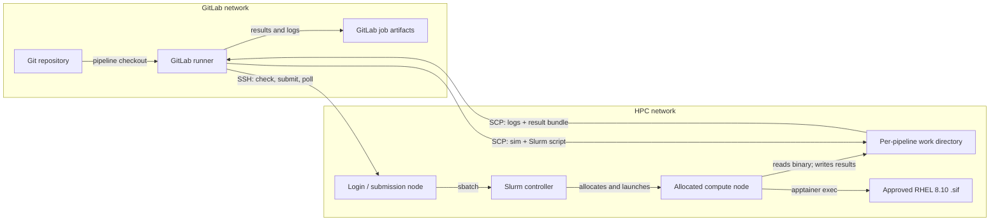
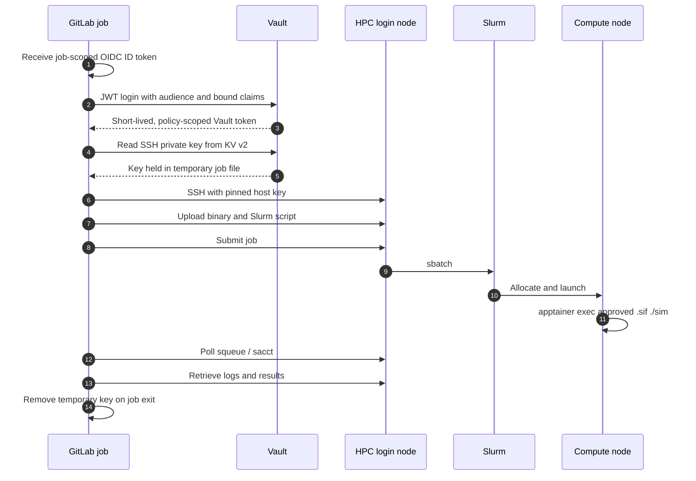
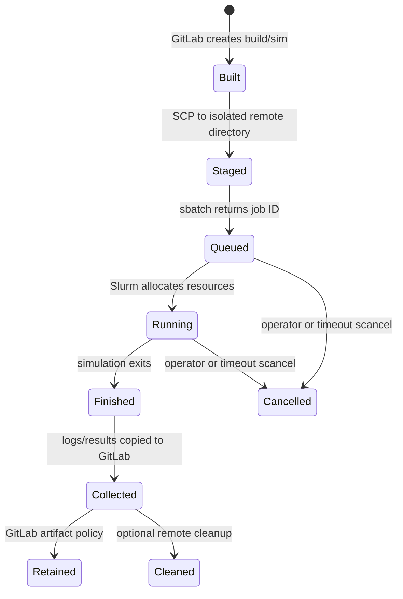

# Architecture

## Runtime path

The runner never SSHes to a compute node. It uses the login node only for file
staging and Slurm commands. Slurm decides where and when the simulation runs.

## Credential path for MVP 5

## Components and ownership

| Component | Suggested owner | Change frequency | Approval boundary |
|---|---|---:|---|
| Simulation source/binary | Application team | Frequent | Normal code review |
| Runtime OCI image (RHEL 8.10) | Runtime/image team | Occasional | Image scan and site conversion review |
| Approved `.sif` | HPC site administrators | Rare | Site approval; immutable path or digest |
| Slurm job settings | Application + HPC platform teams | Occasional | Queue/account/site policy |
| SSH account and authorized key | HPC site administrators | Rotated | Least privilege and audit policy |
| Vault JWT role/policy | Security/Vault administrators | Rare | Bound project/ref/audience claims |
| GitLab pipeline | Application/CI team | Frequent | Protected branches and CI review |

## Trust boundaries

1. **GitLab runner boundary.** The runner receives source, the binary, and a
   temporary credential. Use a trusted runner; avoid shared untrusted runners.
2. **SSH boundary.** Pin the HPC login-node host key. The runner does not learn
   host keys dynamically during a job.
3. **Login-node boundary.** The SSH account can stage files and submit only its own
   Slurm jobs. It should not have administrative privileges.
4. **Scheduler boundary.** Resource policy is enforced by Slurm. CI does not pick
   a compute-node hostname.
5. **Container boundary.** The `.sif` is an approved runtime artifact, not a general
   security sandbox. Site policy controls mounts, devices, and execution.

## Data lifecycle

Keep remote runs until results are safely collected. Apply a separate,
administrator-approved retention process to abandoned directories.

